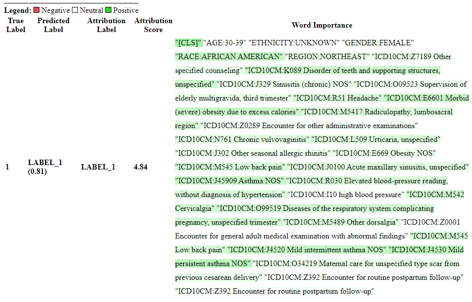

[](LICENSE)
[](https://www.python.org/)
[](https://pytorch.org/)

Generate Explanations for BERT Predictions on Structured Electronic Health Record Data
======================================================================
[](LICENSE)

Recent breakthroughs in large language models have been reapplied to structured electronic health records (EHR). 

**To explain clinical BERT model predictions, we present an approach which leverages integrated gradients to attribute events in medical records that lead to an outcome prediction.**
<div style="display: flex; justify-content: space-around; align-items: center;">
    
    
    
</div>

The explainability approach we have developed can be applied to many diseases and prediction tasks using language models trained on structured electronic health records.

_ℹ️ This repository was created to compliment the manuscript "Predicting Progression and Key Drivers of Asthma with a Clinical BERT model and Integrated Gradients" which is available here: [coming soon]()_

## [Pre-requisite] Training a MEDBERT Model
The explainability pipeline requires a BERT-based model trained on structured EHR data and fine-tuned for the specific disease prediction task. 
The pre-training procedure most closely follows the method described in the [TransformEHR](https://www.nature.com/articles/s41467-023-43715-z) paper, 
and the fine-tuning is primarily based on the approach used in the [Med-BERT](https://doi.org/10.1038/s41746-021-00455-y) model.
We have also provided a sample input and output data sample in `data/dummy_data.parquet` and `output/output.parquet` respectively. This will demonstrate the format you may expect if you chose to adopt this code. The `output.parquet` dataset can be further post-processed  to aggregate the top tokens for explainability.

## Install
```
# Install conda environment
conda create -n bert-explainability python=3.10 -y
conda activate bert-explainability

# Install dependencies
pip install -r requirements.txt
export PYTHONPATH=$PYTHONPATH:./src:./transformers_interpret
```

## Sample Script for Running the Pipeline
```
python3 -m src.explainability.explainability './config/explainability_asthma.yaml' './bert_finetuning_asthma_model.tar.gz' './data/' './output/'
```

## Input data format
A small dummy dataset has been provided in `data/*` and `notebooks/example_walkthrough.ipynb`. The data is assumed to be parquet files stored locally or from s3, with the following schema: person_id (int), sorted_event_tokens (array<string>), day_position_tokens (array<int>).
- person_id: A unique identifier for each individual.
- day_position_tokens: An array representing the relative time (in days) of events, with 0 indicating demographic tokens.
- sorted_event_tokens: A list of event codes associated with the individual. Each event corresponds to the relative date indicated by its index in the day_position_tokens array.
  - The first five tokens are always assumed to be demographic tokens, in the order of age, ethnicity, gender, race, and region.
- label: Label for the patient for a specific prediction task.

## Config
The config can be found in `config/explainability_asthma.yaml`. It can be modified for multiclass prediction purposes.
It contains the following parameters:
- model_max_len: Maximum token length for the model (e.g. 512).
- training_label: Name of the label column.
- internal_batch_size: Batch size used during processing. 
- demographic_token_starters: Prefixes of tokens that belong to demographic categories.
- avg_token_type_baseline: A boolean flag that determines if the baseline for lab test tokens with percentile information is the average percentile (True) or the 5th percentile (False).

If doing multiclass predictions:
 - num_labels: Number of classes.

## Output data format
The output is stored as an `output.parquet` file in the directory specified. 

## Contacts
For any inquiries please raise a git issue and we will try to follow-up in a timely manner.

## License
This work is available for academic research and non-commercial use only. See the _LICENSE_ file for details.

## Acknowledgements
This package utilizes functions from [transformers-interpret](https://github.com/cdpierse/transformers-interpret). All utilized functions are located in the `transformers_interpret/` subdirectory and are licensed under the Apache License Version 2.0.
